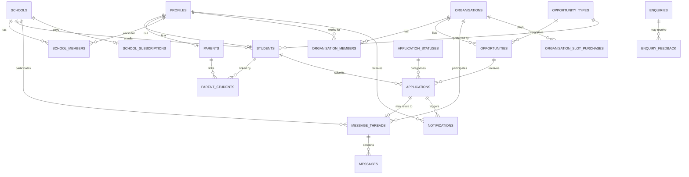

# ilearn4u — Entity Relationship Diagram

Rendered from `supabase/migrations/0001_schema.sql`. Paste this file into any
Mermaid-compatible viewer (GitHub renders it natively) to see it visually.



## Reading the safeguarding boundary off this diagram

Notice there is **no direct line between STUDENTS and ORGANISATIONS, and no
direct line between STUDENTS and MESSAGE_THREADS.** The only path from a
student to an organisation is:

```
STUDENTS → APPLICATIONS → OPPORTUNITIES → ORGANISATIONS
```

An organisation can only ever see what a student put in a specific
`applications.answers` for that organisation's own opportunity — never the
student's full profile, and never a free-form message. That's enforced twice:
once by the schema shape itself (there's no column for it), and again by the
RLS policies in `0003_rls_policies.sql`.

## Full table list

`profiles` · `schools` · `school_members` · `organisations` ·
`organisation_members` · `students` · `parents` · `parent_students` ·
`opportunity_types` · `application_statuses` · `opportunities` ·
`applications` · `message_threads` · `messages` · `notifications` ·
`school_subscriptions` · `organisation_slot_purchases` · `enquiries` ·
`enquiry_feedback`

See [DATA_DICTIONARY.md](./DATA_DICTIONARY.md) for every column.
